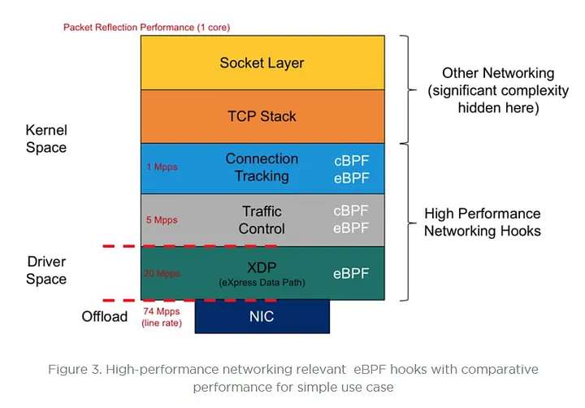
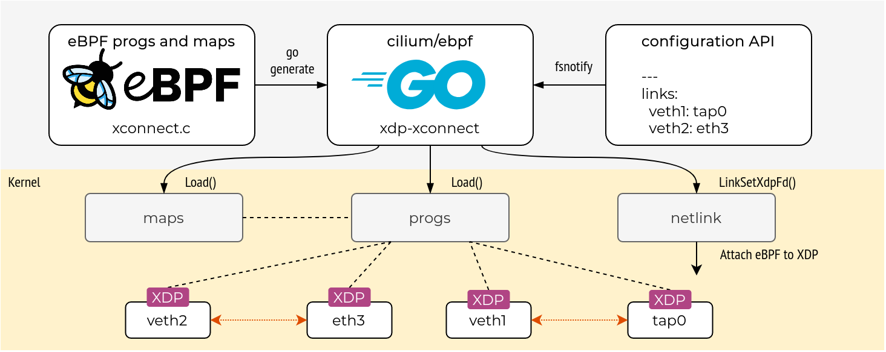

# Mini project in Network Security
# eBPF SNI filter

## Introduction

This project is an implementation of a firewall to block TLS traffic.
It is designed to handle large amounts of traffic and be used by network administrators to block access to specific websites in corporate networks.

The firewall is implemented in kernel space using eBPF XDP hook. The TLS Client Hello packet is parsed before
passing through the kernel IP stack and user space. 
This implementation if therefore very efficient and can handle a large amount of traffic.
The domain name is extracted from the SNI field and is matched against a map stored in the kernel.
Our implementation includes a user space program to load the eBPF program and populate the map with the list of websites to block.
This program is written in Go and uses the `ebpf-go` library to interact with the eBPF program.

## Requirements

In order to compile and run this project you will need the following dependencies:

- Linux kernel version 5.7 or later
- LLVM11 or later (clang and llvm-strip)
- libbpf headers
- Linux kernel headers
- Go compiler version supported by `ebpf-go`'s Go module

## Compilation

To compile the project, run the following command:

```bash
go generate
go build
```

This will generate the eBPF program and compile the user space program.

## Usage

To run the program, you will need to run it as root. You can use the following command:

```bash
sudo ./ebpf-sni-filter <iface> <domain_list_file>
```

Where `<iface>` is the name of the network interface to attach the XDP program to 
and `<domain_list_file>` is a json file containing the list of domains to block, an example file is provided.

## Indepth explanation

TLS is the underlying protocol for HTTPS, it is used to encrypt the communication between the client and the server.
The first packet sent by the client is the Client Hello packet, it contains information about the client's capabilities and preferences.
One of the fields in the Client Hello packet is the Server Name Indication (SNI) field, it contains the domain name of the server the client is trying to connect to.
The SNI field is required for the server to know which certificate to send to the client, as a server can host multiple domains.
This is especially important for shared hosting providers and CDNs.
The SNI field is sent in plaintext and can be easily extracted by a passive observer. It isn't encrypted because the client and the server
have yet to exchange certificate and agree on a key to encrypt the communication with (ESNI will be addressed later).
This makes it possible to block traffic to specific websites based on the domain name in the SNI field. 
This is very common in firewalls and content filtering systems. 
Blocking by domain name is more efficient than blocking by IP address as the domain name can be shared by multiple IP addresses.
In addition, multiple sites can be hosted on the same IP address, this is especially true for CDNs and cloud providers.

eBPF is a technology that allows us to run programs in the kernel without modifying the kernel source code or loading a kernel module.
eBPF programs are written in a restricted C-like language and are compiled to a bytecode that is executed by the kernel.
They can be attached to hooks in the kernel to intercept packets and perform actions on them. 

Our implementation uses the eBPF XDP hook to intercept the packets before they are processed by the kernel IP stack.
This allows us to parse the SNI field and block the packet before it reaches the user space.
This is very efficient as the packet is not processed by the kernel IP stack or copied to user space.
The eBPF program is loaded into the kernel and attached to a network interface.
The program is written in C and compiled with clang and LLVM.

The user space program is written in Go and uses the `ebpf-go` library to interact with the eBPF program.
It loads the eBPF program into the kernel and populates a map with the list of domains to block.
The map is a key-value store that is shared between the eBPF program and the user space program.
The user space program reads the list of domains from a json file and writes them to the map.
The eBPF program reads the domain from the SNI field and checks if it is in the map.
If the domain is in the map, the packet is dropped, otherwise it is passed through.
The eBPF program updates the map to count the number of packets dropped for each domain.
The go application reads the map periodically to print the statistics.




## Limitations

Our implementation has some limitations:

- ESNI: Encrypted SNI is an extension to TLS that encrypts the SNI field. 
This would make it impossible to block traffic based on the domain name. 
It relies on the client receiving the server's public key in a DNS record. 
This is still not widely adopted and is not used by major websites.
- IP fragmentation: Our implementation does not handle IP fragmentation. We only parse the first fragment of the packet.
The SNI field can be split across multiple fragments, and we would miss it. While IP fragmentation is extremely rare in practice 
for TLS Client Hello packets it is a known circumvention technique. 
It is even reported to bypass states content filtering systems such as the Great Firewall of China.
- Ingress traffic only: XDP programs are attached to the ingress path of the network interface, they do not handle egress traffic.
Our implementation only blocks incoming traffic, it does not block outgoing traffic. It is meant to be deployed at the edge of the network on firewalls and routers.
It will not block traffic if deployed on the client side.
- IPv6: Our implementation only handles IPv4 packets at the moment. We would need to modify the eBPF program to handle IPv6 packets.